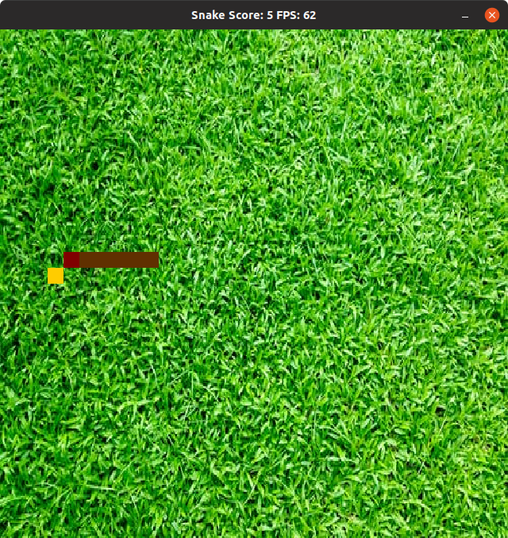

# CPPND: Capstone Snake Game Project

## Basic Build Instructions for Ubuntu 19.04

This program requires *SDL2, SDL2_image* and *SDL2_mixer* libraries. I use the `apt-get` method to install them.

```
sudo apt-get install libsdl2-dev

sudo apt-get install libsdl2-image-dev

sudo apt-get install libsdl2-mixer-dev
```

To build the executable, I followed the steps below:

1. Clone the [starter repository](https://github.com/udacity/CppND-Capstone-Snake-Game).
2. Make a build directory in the top level directory: `mkdir build_Linux && cd build_Linux`
3. Compile: `cmake .. && make`
4. Run it: `cd .. && ./build_Linux/SnakeGame`

For `cmake` to work, I had to modify the `CmakeList.txt` file as follows

```
cmake_minimum_required(VERSION 3.7)
project(SDL2Test)
set(CMAKE_CXX_FLAGS ${CMAKE_CXX_FLAGS} "-std=c++17 -pthread")
set(CMAKE_MODULE_PATH ${CMAKE_MODULE_PATH} "${CMAKE_SOURCE_DIR}/cmake/")

find_package(SDL2 REQUIRED)
find_package(SDL2_image REQUIRED)
find_package(SDL2_mixer REQUIRED)

include_directories(${SDL2_INCLUDE_DIRS} ${SDL2_IMAGE_INCLUDE_DIRS} ${SDL2_MIXER_INCLUDE_DIRS} src)

add_executable(SnakeGame src/main.cpp src/game.cpp src/controller.cpp src/renderer.cpp src/snake.cpp)
target_link_libraries(SnakeGame ${SDL2_LIBRARIES} ${SDL2_IMAGE_LIBRARIES} ${SDL2_MIXER_LIBRARIES}  )
```

to include the `-pthread` flag and directory paths for `SDL2, SDL2_image` and `SDL2_mixer`.

## Project Description

I modified starter codes in the [CppND-Capstone-Snake-Game](https://github.com/udacity/CppND-Capstone-Snake-Game) GitHub repository to post a background picture of grass and play background music while the game is running. The background picture is read in as a `JPEG` file and the music is read in as a `WAV` file and played in a separate thread.

The Snake game code consists of four main classes: `Game`, `Snake`, `Controller`, and `Renderer`. The image below shows how the code functions:

1. To begin, `main` creates a `Controller`, a `Game`, and a `Renderer` object. `Game` stores a `Snake` object as part of the state.
2. `main` calls `Game::Run` to start the background music and game loop.


The image below shows the output from the game. The snake head is in dark red color and its tail is brown in color. Food is in yellow.  The movement is controlled by the `up, down,right` and `left` arrow on the keyboard. Every time the snake eats food, it is awarded with one point and its tail grows by one block. While the game is running, one can hear background music. To terminate the game, we click the orange button on the upper right hand corner.



# 5 total criteria from the rest of the rubric are addressed

1. The project uses multi-threading
2. The project reads data from a file and process the data
3. The project accepts user input and processes the input
4. The project uses destructors appropriately
5. The project uses Object Oriented Programming techniques

For criterion `1` , it is implemented in `game.cpp` from line `10 `to `36` and line `56`.

For criterion `2` , it is implemented in `renderer.cpp` from line `35 `to `40` and line `66`.

For criterion `3` , it is implemented in `controller.cpp` from line `12 `to `40` and in `snake.cpp` from line `5` to line 39.

For criterion `4` , it is implemented in `snake.h` in line `20`.

For criterion `5` , it is implemented in all 4 classes, a good example is file `game.cpp`